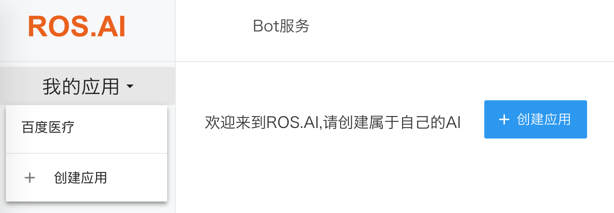
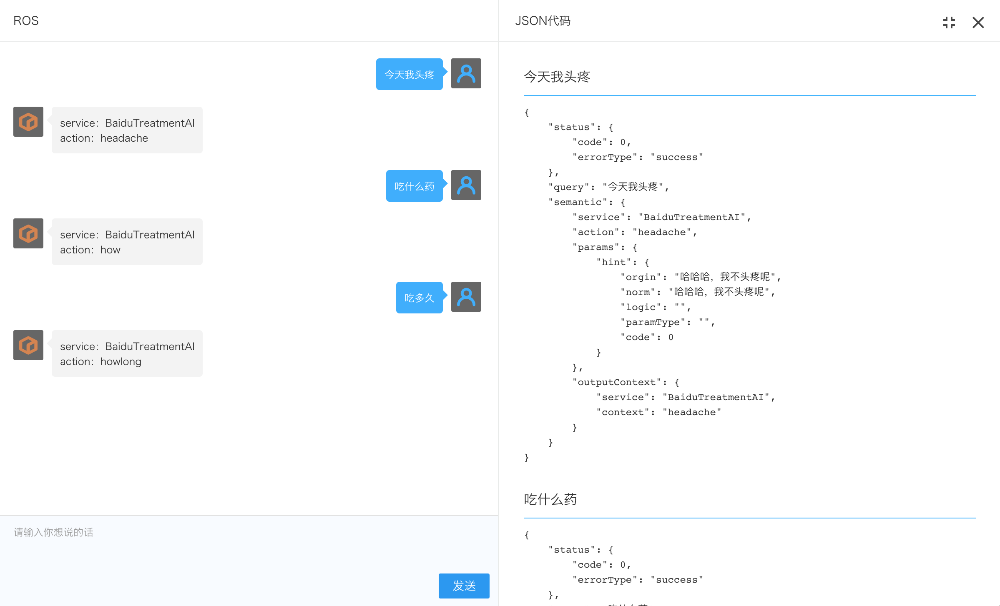

# ROS.AI 使用说明

版本 | 日期| 说明 | 作者
:---: | :--- | :--- | ---
1.0|20171103|init|Lee

ROS.AI提供一套后台系统给用户做特定的配置。
首先申请ROS.AI后台账户(分开发环境和正式环境)，找*林原*

1. 登录ROS.AI后台。测试环境地址 http://account-test.roobo.net

2. 进入后创建应用。创建新的应用或在我的应用下进入某个应用。

3. 应用主页

4. 创建场景
输入场景名称、描述后点击保存即可创建新的场景。

5. 创建意图（action）
对意图的创建、修改是最重要的工作，将在后面详细介绍，下面是已经创建好的意图：

6. 测试
点击语义测试可弹出右侧测试对话框，输入文字即可测试是否命中编辑好的意图。
	* service 表示场景
	* action 表示意图

下图显示了2次测试：
1) 输入“今天我头疼”，命中“BaiduTreatmentAI” 场景的“headache”意图。
2) 输入“吃什么药”，命中“BaiduTreatmentAI” 场景的“how”意图。

测试结果和预期一致即表明创建的意图是正确的，否则要修改意图。
**意图编辑好后需要进行大量测试，除了保证意图本身的正确性，还要防止和其它意图（包括其它场景的意图）冲突。**

点击右上角的放大按钮还可以查看服务器返回的详细信息,见下图，右侧即是服务器返回的信息。

## 意图（action）
创建好的意图：

创建意图的页面

### 模板语法
以意图 “headache” 为例新建了一个模板：
**[今天|最近|这段时间|][我|]头疼**

[] 表示语句块，一句话由多个语句块组成，没有[]包含的文字也是一个语句块
|  表示或

* [今天|最近] 表示 今天或最近
* [今天|最近|这段时间|] 表示 今天或最近或这段时间或空，空指可以没有这个语句块

#### 添加参数

模板里还可以通过添加参数获取内容,以意图“pressure”为例：
**血压[@sys.any:pressure]**

用户说 “血压600”，命中该意图，pressure参数的值为600

#### 获取参数
上图**参数**栏表示参数会添加到返回给布丁豆的数据里，
参数pressure取值是pressure，后一个pressure即是上面**血压[@sys.any:pressure]**获得的值。

下图是参数可取的值类型，是ROS.AI内部定义的类型。
**@sys.any** 指任何类型

### 上文、下文
一句话可能需要上下文才能理解其含义，比如“怎么办”，没有上文不知如何理解。下图测试的是拥有上下文的3个意图。通过几个意图的连接可表达更高级的语义。

下面是这3个意图的信息

## 其它设置
### 问答管理

### 基本设置
ROS.AI后台有几个默认的回答引擎，用户可根据需要关闭或打开其中之一

