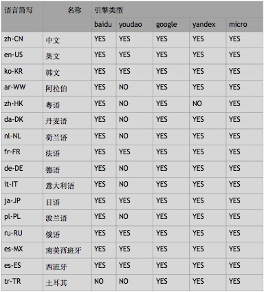

# Roobo iOS文本翻译SDK

版本 | 日期| 说明 | 作者
:---: | :--- | :--- | ---
0.2.0|20171215|init| 李路天


翻译sdk可实现多引擎多语言的文本翻译

1. 到 roobo 翻译网站创建项目并设置项目的类型
2. 接入 **RBTranslate.framework** SDK

## 接入sdk

1. 复制 **RBTranslate.framework** 文件到工程目录下
2. 在xcode中添加依赖**RBTranslate.framework**
3. 添加系统库 **'SystemConfiguration', 'MobileCoreServices', 'CoreGraphics', 'Security'**
4. 引用头文件：```#import <RBTranslate/RBTranslate.h>```
5. 正常开发

添加依赖方法
1. Click on the project navigator
2.	Choose the target
3.	Click on **Build Phases**
4.	Click on the "+" icon in **Link Binary With Libraries**

### 翻译主要流程：
1. 获取```RBTranslate```的单例对象
2. 认证，分App模式和设备SN模式，认证成功后方可执行以下步骤
3. 获取支持的翻译语言
4. 调用翻译接口翻译文本

### 服务器返回数据格式
```json
{
	"status":{
		"code":200,		  	  // 错误码
		"msg":"验证成功",	   // 描述信息
		"codeType":"roobo"   // 错误类型，文字翻译API独有
	},
	"result":{
		// 数据，数据类型请查看接口的详细说明
	}
}
```

### API请求接口的回调
API请求接口的回调与**AFNetworking 3.1**回调相同
```objc
success:(void (^)(NSURLSessionDataTask* task, id responseObject)) success
failure:(void (^)(NSURLSessionDataTask* task, NSError* error)) failure
```

## API文档
### 获取```RBTranslate```单例对象
```objc
/**
 获取RBTranslate单例对象

 @return RBTranslate的单例对象
 */
+(id) shareTranslate;
```

### 认证
```objc
/**
 认证, App模式

 @param projectID 项目ID
 @param publicKey 公钥
 @param success 成功回调
 @param failure 失败回调
 */
-(void)authApp:(NSString*)projectID publicKey:(NSString*)publicKey success:(void (^)(NSURLSessionDataTask * task , id responseObject ))success
       failure:(void (^)(NSURLSessionDataTask * task , NSError *  error))failure;

/**
 认证, 设备SN模式

 @param projectID 项目ID
 @param sn 设备SN
 @param publicKey 公钥
 @param success 成功回调
 @param failure 失败回调
 */
-(void)authSN:(NSString*)projectID WithSN:(NSString*)sn publicKey:(NSString*)publicKey success:(void (^)(NSURLSessionDataTask * task , id responseObject ))success failure:(void (^)(NSURLSessionDataTask * task , NSError *  error))failure;

```

开发者只需关心code是不是成功即可，返回数据：
```json
{
	"status":{
		"code":200,
		"msg":"验证成功"
	},
	"result":{
		"info":"xxxxxx"
	}
}
```

### 是否认证成功
```
/**
 是否认证成功

 @return TRUE 认证成功，FALSE 认证失败
 */
-(BOOL) isAuth;
```
### 获取支持的语言
```objc
/**
 根据projectID获取支持的语言
 
 */
-(void) getSupportLanguage:(void (^)(NSURLSessionDataTask *  task, id  responseObject))success
                   failure:(void (^)(NSURLSessionDataTask * task , NSError *  error))failure;
```
返回数据：
```json
{
	"status":{
		"code":200,
		"msg":"验证成功"
	},
	"result":{
		"engine":[
			"baidu":["zh-CN","en-US","ko-KR"..."ru-RU","es-MX","es-ES"],
			"youdao":["zh-CN","en-US","ko-KR"..."ru-RU","es-MX","es-ES"]
		]
	}
}
```

### 文字翻译
```objc
/**
 文字翻译

 @param type 翻译引擎类型
 @param from 源语言
 @param to 目标语言
 @param query 请求翻译的文本，UTF-8编码格式
 @param success 成功回调
 @param failure 失败回调
 */
-(void) translate:(NSString*)type from:(NSString*)from to:(NSString*)to query:(NSString*)query success:(void (^)(NSURLSessionDataTask *  task, id  responseObject))success
          failure:(void (^)(NSURLSessionDataTask * task , NSError *  error))failure;
```

翻译成功，返回数据：
```json
{
	"status":{
		"code":200,
		"msg":"翻译成功"
	},
	"result":{
		"query":"good morning",
		"from":"zh-CN",
		"to":"en-US",
		"dest":"早上好", 
		"type":"baidu"   
	}
}
```
翻译失败返回数据：
```json
{
	"status":{
		"codeType":"roobo",
		"code": 800033,
		"msg":"翻译失败"
	},
	"result":{
		"type":"baidu",
		"from":"en-US",
		"to":"zh-CN",
		"query":"good morning",
		"sid":"xxxxx",
		"projectID":"xxxxx",
		"package/sn":"zzzzz",
		"token":"111111",
		"timestamp":""
	}
}
```

## 参考
### 支持的翻译引擎

引擎类型（type） | 说明 |
:---:| ---|
default|默认类型，由服务器决定使用下面哪种引擎|
baidu|百度|
youdao|有道|
google|谷歌|
yandex|yandex|
micro|微软|

### 支持的语言




### 错误码
错误码根据错误来源分为以下几个类型：

错误码类型（type） | 说明 |
:---:| ---|
roobo| roobo|
baidu|百度|
youdao|有道|
google|谷歌|
yandex|yandex|
micro|微软|

#### roobo
#### 百度
#### 有道
#### 谷歌
#### yandex
#### 微软

