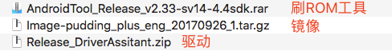
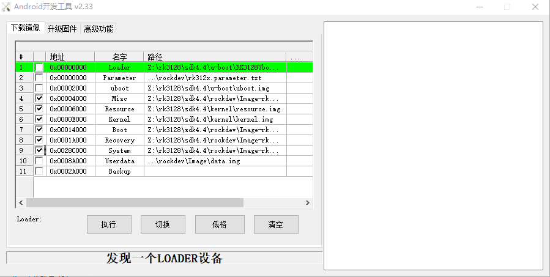
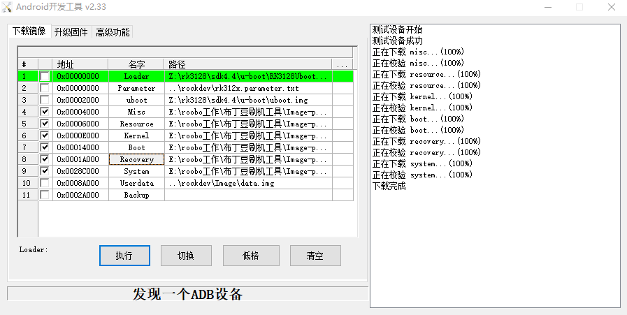
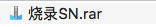

# 布丁豆刷ROM教程

版本 | 日期| 说明 | 作者
:---: | :--- | :--- | ---
1.0|20171031|init|Lee

##前期准备
1. 布丁豆设备1台和数据线一根
2. 准备刷ROM工具、ROM文件、驱动

3. Windows电脑一台（虚拟机不行）
4. 配置电脑环境：将adb添加到环境变量

##刷机
1. 将压缩包解压，并安装驱动
2. 布丁豆设备打开开发者模式：设置里按“系统版本”7次
3. 都过```adb devices```可发现设备
4. 将设备设置为Loader状态：```adb reboot loader```
5. 打开刷机工具，选中4-9项，并根据刷机工具里的“名字”列依次选中ROM镜像里的img文件

6. 当设备处于Loader状态并选好镜像后，点击“执行”开始刷ROM
7. ROM刷好后设备自动重启，重启成功后即刷机成功


*注意：刷机失败可以重新刷机。
插上电源，在关机情况下长按下reset键+电源键可进入Loader模式*

##烧录SN
有一批设备的SN号专门用于开发使用，可以在正式环境和开发环境直接使用。烧录SN包里有教程。


