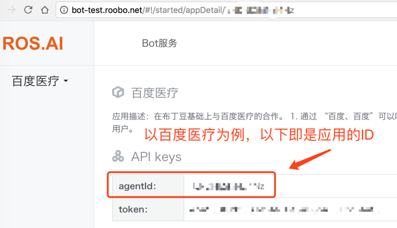
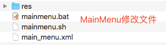

# 布丁豆应用开发流程

版本 | 日期| 说明 | 作者
:---: | :--- | :--- | ---
1.0|20171031|init|Lee

1. 准备一台布丁豆，将ROM刷成eng版
2. 烧录开发sn号。sn号连接设备后可通过```adb devices```获得
3. 申请渠道号，渠道号要保证唯一性 [申请渠道地址](http://wiki.365jiating.com/pages/viewpage.action?pageId=362000) 
4. 申请ROS.AI后台账户（分开发环境和正式环境），找*林原* 
5. 绑定设备sn：渠道号和ROS.AI的应用ID（ROS.AI的应用后台获取，见下图），以及设备sn号需添加到后台管理系统，找*林原* 
6. 绑定应用：渠道号和ROS.AI的应用信息（agentId和token）相绑定，找*林原* 


7. 修改主控app的渠道号，在**Configure**项目里**DatabaseHelper#initChannel** 方法处修
8. 卸载布丁豆里的**Configure**应用，再安装修改后的**dev**环境的**Configure**应用。**Configure**应用会将xml里的配置读到数据库里，所以更新配置需先卸载（清数据）再安装。
	注意：ROM里的应用在```/system/priv-app```目录下，删除apk即可，还需到```/data/data```目录下删除对应的数据。
9. 安装**dev**环境的**Core**应用，使布丁豆运行在开发环境
10. 场景可以加入到MainMenu中。（不是必须）

## 系统ROM
### ROM版本信息
```shell
$adb shell getprop ro.roobo.version.release
R006B100D040C00
```
[ROM 版本规范](http://wiki.365jiating.com/pages/viewpage.action?pageId=5446761)

* R006 表示产品名称，如：001表示布丁
* B100 表示芯片基线版本、基线升级版本，包括芯片基线、重大特性升级
* D040 表示是ROM版本号 040
* C00 表示定制版本号，00为通用版本，非00版本为定制版本号

##烧录特殊的开发sn号
开发sn号可用于测试环境和线上环境，总数有限，每用一个需要注明。刷sn号需先将设备ROM刷成eng版ROM。


## 将场景加入到 MainMenu
MainMenu应用不是Launcher, Launcher是一对眼睛，MainMenu是Launcher下方的应用列表。通过修改配置信息可以将自定义的场景加到MainMenu上。


### 配置场景信息 main_menu.xml
main_menu.xml 文档配置场景的相关信息，以添加 “布丁之家” 场景为例：
1. name 是MainMenu上显示的场景名称；
2. sceneName 是模块名称，即上文在AndroidManifest.xml里配置的ROOBO_MODULE_NAME信息；
3. iconPath 是MainMenu上显示的场景图片，图片存放在main_menu.xml同目录的res文件夹内；
```xml
<?xml version="1.0" encoding="gbk"?>
<menu>
<item name="布丁之家" sceneName="TASK_CENTER" iconPath="icon_pudding_home.png" />
<item name="双语课程" sceneName="RKID" iconPath="icon_school.png" />
<item name="双语视频" sceneName="KOOLEARNDONUT" iconPath="duona_tv.png" ><data key="action" value="DonutTv"/></item>
</menu>
```

### 运行脚本 mainmenu.bat 或 mainmenu.sh
脚本会创建相关目录并将 main_menu.xml 和 图片资源 push到布丁豆系统内，然后杀死MainMenu应用，使其重新启动读取配置文件。


